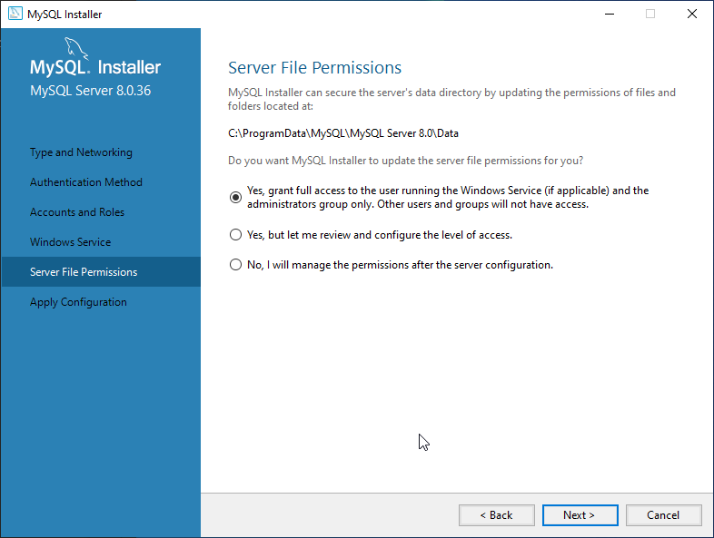

## Installing MySQL

Download the installer from [here](https://dev.mysql.com/downloads/installer/).

Run it.

Select "Full installation" (unless you know exactly what you are doing).

You should see these components. Click on "Execute".

> If for some reason, the installer says "Failure to download" on one or more items, just click on "< Back" and then select "Full installation" again and then "Execute" until all components are successfully downloaded and installed. Then click on "Next".

Click "Next" again.

Click "Next" again.

Use Strong password, click "Next".

Set a strong :) password of your choosing (e.g. 12345)
The User accounts section can be left empty, as we can add users later easily. Click "Next".

Leave everything else on default once again and click "Next".

And "Next" yet again.

Finally, click on "Execute".

After the installation is successful, the "Mysql Router configuration" window will pop up. We do not need to configure that, so either "X" it, or just click through "Next" and "Finish" again. Same with the "samples and examples".

Now we can launch "MySQL Workbench" from the Start menu.

Select "Local instance MySQL80" and enter your password to enter.

The following is the screen we should arrive to.

