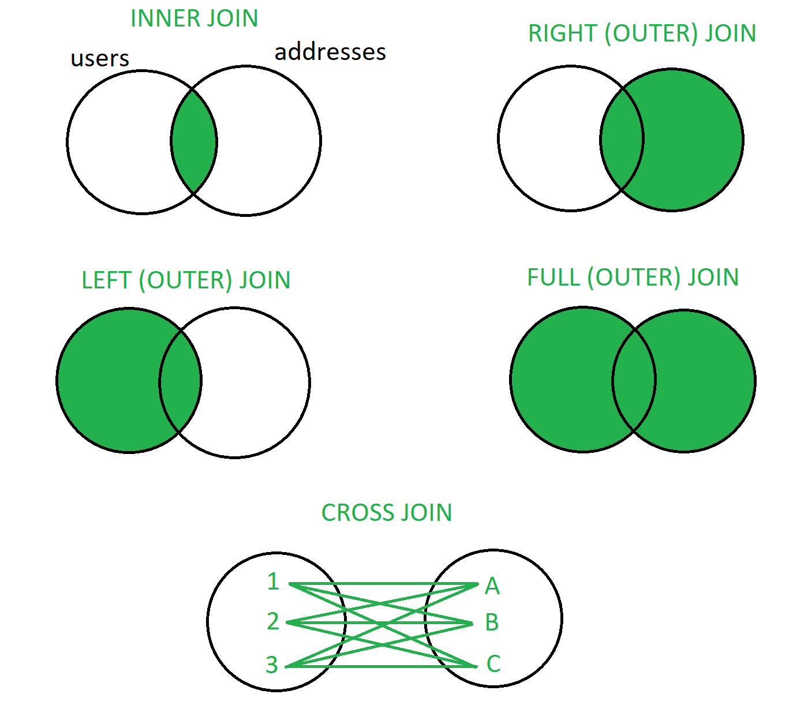

## Select, querying data

> After deleting all data in the previous section, as well as to have a better starting point to practicing queries, let's add a little more data to the foods table first.

```sql
INSERT INTO foods (name, description, price, image) VALUES 
  ('Pizza', 'A delicious pizza topped with mozzarella, tomato sauce, and pepperoni.', 12.99, 'pizza.jpg'),
  ('Burger', 'A juicy burger with lettuce, tomato, onion, and cheese, served on a sesame seed bun.', 9.99, 'burger.jpg'),
  ('Sushi', 'Fresh and delicious sushi rolls with a variety of fillings, including tuna, salmon, and avocado.', 18.50, 'sushi.png'),
  ('Taco', 'Crispy tacos filled with seasoned ground beef, lettuce, cheese, and salsa.', 6.99, 'taco.png'),
  ('Pad Thai', 'A classic Thai dish made with rice noodles, vegetables, peanuts, and your choice of meat or tofu.', 14.75, 'padthai.jpg'),
  ('Fried Chicken', 'Crispy and juicy fried chicken served with mashed potatoes and gravy.', 11.25, 'friedchicken.png'),
  ('Pasta', 'A hearty pasta dish with your choice of sauce, including marinara, alfredo, or pesto.', 8.99, 'pasta.jpg'),
  ('Steak', 'A perfectly grilled steak, cooked to your liking and served with a side of vegetables.', 22.50, 'steak.jpg'),
  ('Fish and Chips', 'A classic British dish of battered fish and thick-cut fries, served with tartar sauce.', 13.75, 'fishandchips.gif'),
  ('Chicken Caesar Salad', 'A fresh and delicious salad with romaine lettuce, grilled chicken, parmesan cheese, and croutons.', 9.50, 'caesarsalad.jpg'),
  ('Pho', 'A flavorful Vietnamese soup made with beef broth, rice noodles, and your choice of meat or tofu.', 12.99, 'pho.png'),
  ('Miso Soup', 'A traditional Japanese soup made with miso paste, tofu, and seaweed.', 4.99, 'miso.jpg'),
  ('Gyudon', 'A popular Japanese dish of thinly sliced beef and onions served over rice.', 11.50, 'gyudon.jpg'),
  ('Lobster Roll', 'A delicious sandwich made with fresh lobster meat, mayonnaise, and a buttered roll.', 12.99, 'lobsterroll.jpg');
```

SQL `SELECT` queries are used to retrieve data from a database. 
They allow us to specify which columns we want to retrieve specific data from one or more tables based on specified criteria (applying filters), and sorting the results among other things.

The basic syntax of a `SELECT` query is:

```sql
SELECT column1, [column2, ...]
FROM table_name;
```

First we specify which columns (projection) to retrieve data from by listing their names after the `SELECT` keyword. We can retrieve data from one or more columns, separated by commas.
Then of course we also have to specify the table from which we want to retrieve data using the `FROM` keyword followed by the table name.

As the most trivial example, we can select all the foods' names from the table:

```sql
SELECT name FROM foods;
```

And the same, with grabbing both names and descriptions:

```sql
SELECT name, description FROM foods;
```

If we want to retrieve all columns, we can use the special `*` char instead of specifying column names:

```sql
SELECT * FROM foods;
```

We can also select columns with specific names using the `AS` keyword. These names can be later on referenced in the query as well.

```sql
SELECT NAME AS 'foodname' FROM foods;
SELECT NAME AS 'foodname', description AS 'fooddescription', price FROM foods;
```

Also present another keyword `DISTINCT` which is used to select distinct (unique) elements from the table.
Notice how we added two "Pizza"s to the table with the `INSERT INTO` query above which are identical (aside from their IDs).

```sql
SELECT DISTINCT name FROM foods;
```

### Where

We can filter the data using the `WHERE` clause (called selection, or filtering). 
It allows us to specify one or more conditions that must be met for the rows to be included in the result set.

Thus the basic syntax of a `SELECT` query will look like this:

```sql
SELECT column1, [column2, ...]
FROM table_name
WHERE condition;
```

Examples include relational operators like `=`, `>` and `<` among others:

Selecting all foods where the price is higher than 10:

```sql
SELECT * FROM foods WHERE price > 10;
```

Selecting the food with the ID of 15:

```sql
SELECT * FROM foods WHERE id = 15;
```

> We indeed use only a single `=` operator in SQL.

Pattern matching allows us to search for specific patterns or substrings within various text (and char) fields. 
These expressions are always preceeded by the `LIKE` keyword.

Using nothing else, it takes a single string argument that will be evaluated against the correct fields in the table, and will only return true,
returning a row where the searched string is matched exactly.

The query below will only return rows whose name is "Sushi". 
It won't include potential other rows like "Maki Sushi", because it would not be matched fully.

```sql
SELECT * FROM foods WHERE name LIKE 'Sushi';
```

The `_` wildcard matches any single character. It matches one character every time, it cannot match zero.

```sql
SELECT * FROM foods WHERE name LIKE 'S_shi';
```

The `%` wildcard matches any sequence of characters, including zero characters. 

Foods with "rice" being present anywhere in their description:

```sql
SELECT * FROM foods WHERE DESCRIPTION LIKE '%rice%';
```

Foods where the image link points to a "png" image. This query will only match image urls where "png" is the last three character of the field, so "mypng.jpg" will not be matched.

```sql
select * from foods where image like '%png';
```

> More advanced pattern matching is provided through regular expressions using the REGEXP keyword in MySQL. Please refer to the [official documentation](https://dev.mysql.com/doc/refman/8.0/en/regexp.html#operator_regexp).

We can use logical operators such as `AND`, `OR`, `BETWEEN` and `NOT` to combine multiple conditions in the `WHERE` clause.

Description having "rice" and the price of the food being more than 13:

```sql
SELECT * FROM foods WHERE DESCRIPTION LIKE '%rice%' and price > 13;
```

Foods with the price being between 10 and 15. This can be achieved with regular `>` and `<` operators as well.

```sql
SELECT * FROM foods WHERE price BETWEEN 10 AND 15
```

If we want to retrieve only a certain number of rows from the result set, we can use the `LIMIT` clause.

```sql
SELECT * FROM foods LIMIT 3;
```


The returned data can also be sorted using the `ORDER BY` clause. 
By default, data is sorted in ascending order (`ASC`), but `DESC` for descending order can also be specified.

```sql
SELECT * FROM foods ORDER BY price DESC;

SELECT * FROM foods ORDER BY price ASC;
```

We can also sort by multiple columns one after another.

First we sort the result set by price, then by name:

```sql
SELECT * FROM foods ORDER BY price asc, name asc;
```

### CASE

The `CASE WHEN` statement allows us to perform conditional logic within a `SELEC`T statement. 
It's useful when you want to return different values or perform different calculations based on specified conditions. 

```sql
SELECT name, price, CASE
           WHEN price < 10 THEN 'Cheap'
           WHEN price >= 10 AND price <= 15 THEN 'Moderate'
           ELSE 'Expensive'
       END AS price_range
FROM foods;
```

### Aggregate functions

These functions are used to perform calculations on sets of values and return a single result. 
They operate on groups of rows and can be used with the `SELEC`T statement to generate summary statistics or calculated values from a table.

Some of the often used aggregate functions are `MIN`, `MAX`, `COUNT`, `SUM` and `AVG`. For a more comprenehsive list, refer to the [official MySQL documentation page](https://dev.mysql.com/doc/refman/8.3/en/aggregate-functions.html).

`COUNT` counts the number of rows in a result set or the number of non-null values in a specific column.

Count the number of foods present in the database table:

```sql
SELECT COUNT(*) as "number of foods" from foods;
```

> Here, it is especially nice to assign nicer names to the columns retrieved.

Maximum price present: 

```sql
SELECT MAX(price) FROM foods;
```

Then, let's try to do some more involved, but also more useful query.
What is the food with the highest price?
The problem is, that we don't know its name.

The following expression would same logical enough at first glance, but unfortunately will not work.

```sql
select max(price), name from foods;
```

We can solve this problem with a subquery. First, we retrieve the maximum price, then use that price value in a `WHERE` condition.

```sql
SELECT name FROM foods WHERE price = (SELECT MAX(price) FROM foods);

SELECT name, price FROM foods WHERE price = (SELECT MAX(price) FROM foods);
```

Average price of the foods:

```sql
SELECT AVG(price) FROM foods;
```

Name and price of a food, where the price is above average:

```sql
SELECT name, price FROM foods WHERE price > (SELECT AVG(price) FROM foods);
```

### Group by

The `GROUP BY` clause in SQL is used to group rows that have the same values into summary rows, 
typically to apply aggregate functions such as `COUNT()`, `SUM()`, etc. to return a single value for each group.

Essentially we are instructing the database to collect the rows that have the same values in one or more columns and treat them as a single group.
Then the summary values can be calculated on each of these groups individually.

Counting the occurrences of each food item by its name:

```sql
SELECT name, COUNT(*) AS count
FROM foods
GROUP BY name;
```

Groups the foods into price ranges, and counts the number in each range:

```sql
SELECT COUNT(*), CASE
           WHEN price < 10 THEN 'Cheap'
           WHEN price >= 10 AND price <= 15 THEN 'Moderate'
           ELSE 'Expensive'
       END AS price_range
FROM foods GROUP BY price_range;
```


## Update and delete data

We can set new values using the `UPDATE` statement modifying existing records in a table.

The basic syntax is as follows:

```sql
UPDATE table_name
SET column1 = value1, [column2 = value2, ...]
[WHERE condition];
```

> The IDs might not be correct for your instance, change them up in the examples accordingly to valid IDs!

Update the image of the food with an id of 39:

```sql
UPDATE foods SET image = "padthai.gif" WHERE id = 39;
```

Update the name and price of the food with an id of 46:

```sql
UPDATE foods SET name = 'Miso', image = "miso.gif" WHERE id = 46;
```

Deleting food with an id of 10:

```sql
DELETE FROM foods WHERE id = 10;
```

While deleting all rows with the `DELETE FROM table` and `DELETE FROM table WHERE ...` statements keep the (auto-incrementing) id,
if we want that to be reset as well, we can use the `TRUNCATE TABLE` command.

```sql
TRUNCATE TABLE foods;
```

## Working with multiple tables

Let's create another table for storeing user data, and also populate it with some dummy values:

```sql
CREATE TABLE IF NOT EXISTS users (
  id INT AUTO_INCREMENT PRIMARY KEY,
  first_name VARCHAR(255) NOT NULL,
  last_name VARCHAR(255) NOT NULL,
  email VARCHAR(255) NOT NULL,
  registration_date DATETIME NOT NULL
);


INSERT INTO users (first_name, last_name, email, registration_date)
VALUES 
  ('John', 'Doe', 'johndoe@example.com', '2022-01-01'),
  ('Jane', 'Doe', 'janedoe@example.com', '2022-01-02'),
  ('Bob', 'Smith', 'bobsmith@example.com', now()),
  ('Alice', 'Johnson', 'alicejohnson@example.com', '2022-01-04'),
  ('Tom', 'Jones', 'tomjones@example.com', '2022-01-05 16:50:21'),
  ('Tim', 'Brown', 'tb@eccample.ca', '2024-02-03');
```

> Another function available for us to use in MySQL is `CONCAT` which can join together two or more values from (different) columns:
> ```sql
> select concat(firstname, ' ', lastname) as "full name" from users;`
> ```

And let's also create another table for addresses. 
It would have a one to many relationship with the users table as one user can have multiple addresses added, but an address shouldn't be reused across multiple users, even if they are the same.

```sql
CREATE TABLE IF NOT EXISTS addresses (
  id INT AUTO_INCREMENT PRIMARY KEY,
  user_id INT NOT NULL,
  city VARCHAR(255) NOT NULL,
  zip_code VARCHAR(10) NOT NULL,
  street_number VARCHAR(255) NOT NULL,
  CONSTRAINT fk_user
    FOREIGN KEY (user_id)
    REFERENCES users (id)
    ON DELETE CASCADE
);
```

The foregin key constraint got a name assigned, so we can more easily modify it later.
With using the `ON DELETE CASCADE` we also specify to automatically delete the matching records from this table when we delete rows from the connected table.
For example if we delete a user, it makes no sense to keep storeing their address.

> This is again a modelling question, for other relationships, it might make sense not to delete related tables. For example in case of invoices, we might not want to immediately and automatically delete those on a user account's closure or deletion.

Practicing what we already know, let's also add a country field, altering the table structure:

```sql
ALTER TABLE addresses ADD COLUMN country VARCHAR(255) NOT NULL;
```

Finally insert some data:

```sql
INSERT INTO addresses (user_id, country, city, zip_code, street_number)
VALUES
  (1, 'Hungary', 'Budapest', '10001', 'Fo utca 3'),
  (1, 'Denmark', 'Aalborg', '10002', 'Vesterbro 56'),
  (1, 'China', 'Shenzhen', '94234','Haichangn street 2'),
  (2, 'Hungary', 'Debrecen', '90001', 'Kossuth utca 4'),
  (2, 'USA', 'Los Angeles', '90002', 'Maple Avenue 1349'),
  (3, 'Japan', 'Tokyo', '60601', 'Falstaff Avenue 234'),
  (3, 'Finland', 'Helsinki','41713','Aleksanterinkatu 1'),
  (3, 'Japan', 'Sapporo', '60602', 'Higashi-Tonden-dori 66'),
  (4, 'Australia','Sydney', '77001', 'Albion avenue 234'),
  (4, 'Great Britain', 'London', '77002', 'Baker Street 10'),
  (4, 'India', 'New Delhi', '67432','Timarpur Road 14'),
  (5, 'Iran', 'Tehran', '33102', 'Azadi Avenue 65'),
  (5, 'Argentina', 'Buenos Aires', '33101', 'Avenida Belgrano 5');
```

Notice, how if we would try to add a new row of data with a non-existing "user_id", the `INSERT` statement will fail:

```sql
INSERT INTO addresses (user_id, country, city, zip_code, street_number)
VALUES
  (100, 'Ghana', 'Accra', '14764', 'Oyanka St 44');
```

Just list out all the data:

```sql
SELECT * FROM addresses;
SELECT * FROM users;
```

### Joins and queries

Joins are used to combine rows from two or more tables based on a related column between them. 
They help in retrieving data from multiple tables in a single query.

There are various types of `JOIN` operations.

* `INNER JOIN`<br>
Returns rows when there is a match in both tables based on the join condition, returning record that have a matching value in both tables.
Use it when we want to retrieve only the rows that have matching values in both tables, such as retrieving orders along with the customer details.

* `LEFT JOIN` (or LEFT OUTER JOIN) <br>
Returns all rows from the left table and the matched rows from the right table. If no match is found, NULL values are returned for the columns from the right table.
Use it when we want to retrieve all rows from the left table, regardless of whether there is a match in the right table. For example, fetching all users along with their addresses (if available).

* `RIGHT JOIN` (or RIGHT OUTER JOIN) <br>
Returns all rows from the right table and the matched rows from the left table. If no match is found, NULL values are returned for the columns from the left table.
Use it when we want to retrieve all rows from the right table, regardless of whether there is a match in the left table.

* `FULL JOIN` (or FULL OUTER JOIN) <br>
Returns all rows from both tables, combining the result of both LEFT JOIN and RIGHT JOIN. If there is no match, NULL values are returned for the columns from the table where no match is found.
Use it when we want to retrieve all rows from both tables, regardless of whether there is a match or not. It's useful for finding unmatched records or for data comparison.
This operation is not directly defined in MySQL, but we can get it as a UNION of a LEFT JOIN and a RIGHT JOIN.

* `CROSS JOIN` <br>
Returns the Cartesian product of the two tables, i.e., all possible combinations of rows from both tables.
Caution is advised using it, as it can result in a large number of rows and may not be very useful in most scenarios.



> `INNER JOIN` is the default `JOIN` operation in MySQL.

Select all users with their addresses:

```sql
SELECT users.first_name, users.last_name, addresses.street_number, addresses.city, addresses.zip_code, addresses.country
FROM users
JOIN addresses ON users.id = addresses.user_id;
```

Technically, _as long as there are no conflicting column names between the joined tables_, the table names before the column names can be left out, shortening the query above a little bit.

```sql
SELECT first_name, last_name, street_number, city, zip_code, country
FROM users
JOIN addresses ON users.id = addresses.user_id;
```

Another way to shorten the syntax is to name the tables with shorter identifiers. Here we name users "u" and addresses "a":

```sql
SELECT u.first_name, u.last_name, a.street_number, a.city, a.zip_code, a.country
FROM users u
JOIN addresses a ON u.id = a.user_id;
```

> It is good practice to name the used tables before each column to avoid ambiguity.

Name of users who have a hungarian address:

```sql
SELECT distinct first_name, last_name
FROM users
JOIN addresses ON users.id = addresses.user_id
WHERE addresses.country = "Hungary";
```

List of users, coupled with the number of addresses they have:

```sql
SELECT u.first_name, u.last_name, COUNT(a.id) AS num_addresses
FROM users u
LEFT JOIN addresses a ON u.id = a.user_id
GROUP BY u.id;
```

Users with no address:

```sql
SELECT u.first_name, u.last_name
FROM users u
LEFT JOIN addresses a ON u.id = a.user_id
WHERE a.user_id IS NULL;
```

List of users with their "primary" (first added) addresses (with the lowest id value):

```sql
SELECT u.first_name, u.last_name, a.street_number, a.city, a.zip_code, a.country
FROM users u
LEFT JOIN addresses a ON u.id = a.user_id
WHERE a.id = (
  SELECT MIN(id) FROM addresses WHERE user_id = u.id
);
```

Finding users with more than one address:

> Here we use the `HAVING` clause, which can be used with aggregate functions, while the `WHERE` statement can not.


```sql
SELECT u.first_name, u.last_name
FROM users u
JOIN addresses a ON u.id = a.user_id
GROUP BY u.id
HAVING COUNT(a.user_id) > 1;
```

Users registered in the last 30 days:

```sql
SELECT first_name, last_name, email, registration_date
FROM users
WHERE registration_date >= CURDATE() - INTERVAL 30 DAY;
```

Someone who has both a Hungarian and a Danish address:

```sql
SELECT u.first_name, u.last_name
FROM users u
JOIN addresses a ON u.id = a.user_id
WHERE a.country = 'Hungary'
AND EXISTS (
  SELECT *
  FROM addresses a2
  WHERE a2.user_id = u.id
  AND a2.country = 'Denmark'
);
```

> The `EXISTS` operator is used to test for the existence of rows in a subquery. It returns TRUE if the subquery returns at least one row, otherwise it returns FALSE. 

> CROSS JOIN:
> ```SQL
> SELECT u.id, u.first_name, u.last_name, a.street_number, a.city, a.zip_code, a.country
> FROM users u
> CROSS JOIN addresses a;
> ```

> FULL JOIN can be manually constructed as the `UNION` of a left and a right join.


## More complex joins

Let's create two more tables for orders and order items.

```sql
CREATE TABLE orders (
    id INT AUTO_INCREMENT PRIMARY KEY,
    user_id INT,
    order_date TIMESTAMP DEFAULT CURRENT_TIMESTAMP,
    CONSTRAINT fk_order_user
    FOREIGN KEY (user_id)
    REFERENCES users (id)
    ON DELETE CASCADE
);

CREATE TABLE order_items (
    id INT AUTO_INCREMENT PRIMARY KEY,
    order_id INT,
    food_id INT,
    quantity INT NOT NULL,
    CONSTRAINT fk_order
    FOREIGN KEY (order_id)
    REFERENCES orders (id)
    ON DELETE CASCADE,
    CONSTRAINT fk_order_item_food
    FOREIGN KEY (food_id)
    REFERENCES foods (id)
);
```

And also populate them with some data:

```sql
INSERT INTO orders (user_id, order_date) VALUES
  (1, NOW()),
  (2, NOW()),
  (3, NOW()),
  (4, NOW()),
  (5, NOW()),
  (6, NOW());

INSERT INTO order_items (order_id, food_id, quantity) VALUES
  (1, 1, 2),
  (1, 2, 1),
  (2, 3, 1),
  (2, 4, 3),
  (3, 5, 1),
  (4, 6, 2),
  (4, 7, 1),
  (5, 8, 1),
  (5, 9, 2),
  (6, 10, 1),
  (6, 11, 1),
  (6, 12, 1);
```

Now some query practice again.

Retrieve all orders with their respective user information:

```sql
SELECT orders.id AS order_id, orders.order_date, users.first_name, users.last_name, users.email
FROM orders
INNER JOIN users ON orders.user_id = users.id;
```

Retrieve all orders along with the details of the food items included in each order:

```sql
SELECT orders.id AS order_id, foods.name AS food_name, order_items.quantity
FROM orders
INNER JOIN order_items ON orders.id = order_items.order_id
INNER JOIN foods ON order_items.food_id = foods.id;
```

Calculate the total amount spent by each user:

```sql
SELECT users.first_name, users.last_name, SUM(foods.price * order_items.quantity) AS total_spent
FROM orders
INNER JOIN users ON orders.user_id = users.id
INNER JOIN order_items ON orders.id = order_items.order_id
INNER JOIN foods ON order_items.food_id = foods.id
GROUP BY users.id;
```

Calculate the total revenue generated by each food item:

```sql
SELECT foods.name AS food_name, SUM(foods.price * order_items.quantity) AS total_revenue
FROM order_items
INNER JOIN foods ON order_items.food_id = foods.id
GROUP BY foods.id;
```

Find the most ordered food item:

```sql
SELECT foods.name AS most_ordered_food, SUM(order_items.quantity) AS total_quantity_ordered
FROM order_items
INNER JOIN foods ON order_items.food_id = foods.id
GROUP BY foods.id
ORDER BY total_quantity_ordered DESC
LIMIT 1;
```

Retrieve orders placed by a specific user (e.g., John Doe):

```sql
SELECT orders.id AS order_id, orders.order_date, foods.name AS food_name, order_items.quantity
FROM orders
INNER JOIN order_items ON orders.id = order_items.order_id
INNER JOIN foods ON order_items.food_id = foods.id
INNER JOIN users ON orders.user_id = users.id
WHERE users.first_name = 'John' AND users.last_name = 'Doe';
```

Users who have not placed an order (yet):

```sql
SELECT users.first_name, users.last_name, users.email
FROM users
LEFT JOIN orders ON users.id = orders.user_id
WHERE orders.id IS NULL;
```

Retrieve orders from a specific date:

```sql
SELECT orders.id AS order_id, orders.order_date, foods.name AS food_name, order_items.quantity
FROM orders
INNER JOIN order_items ON orders.id = order_items.order_id
INNER JOIN foods ON order_items.food_id = foods.id
WHERE DATE(orders.order_date) = '2024-04-17';
```

