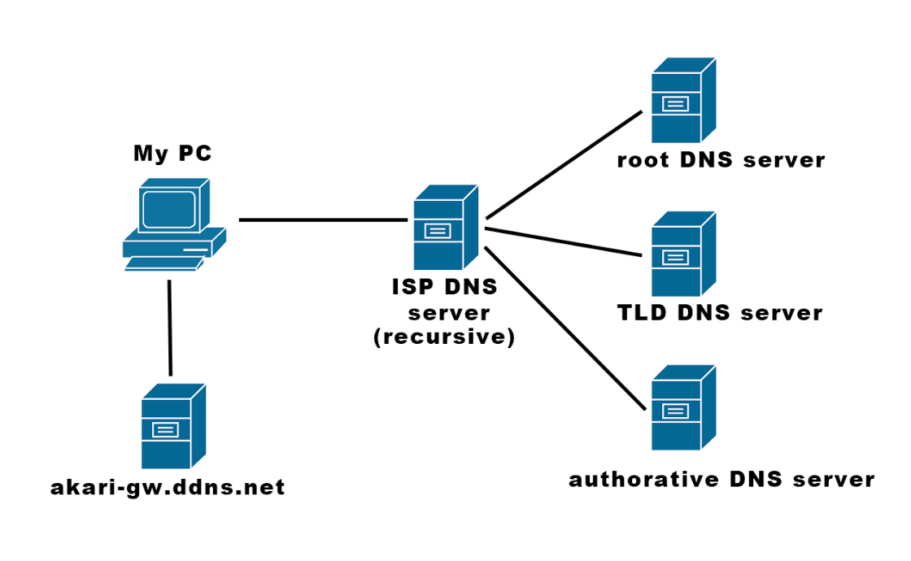
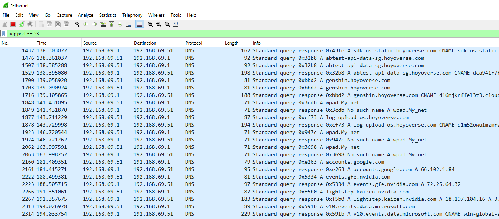
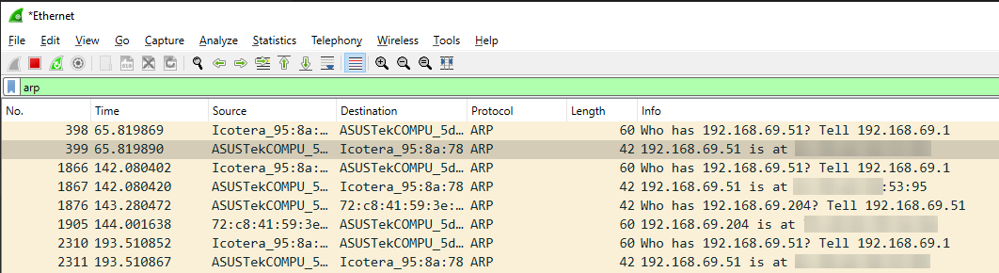
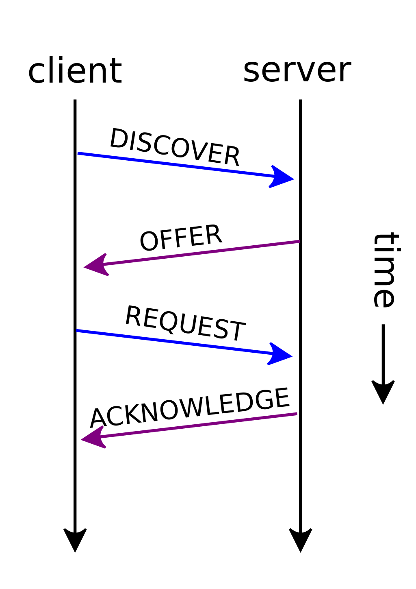
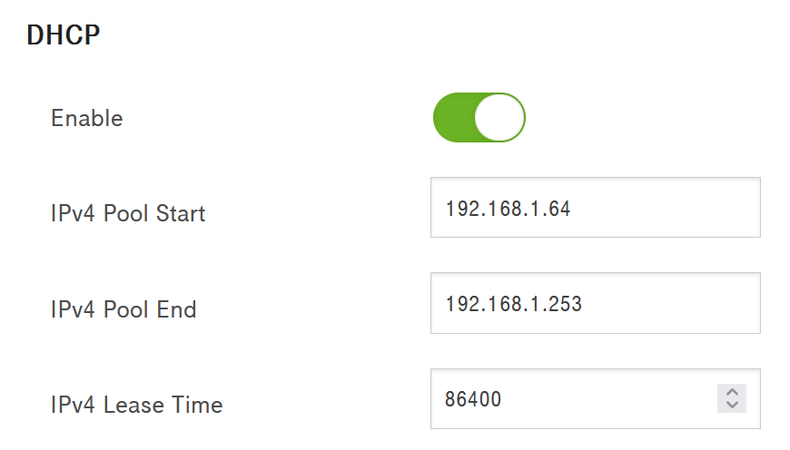
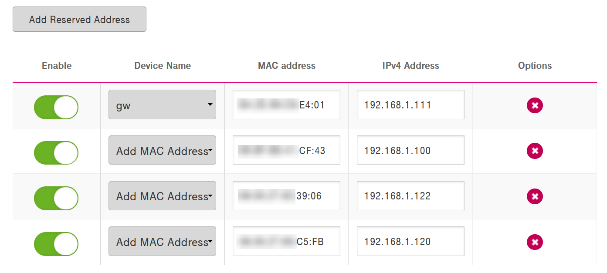
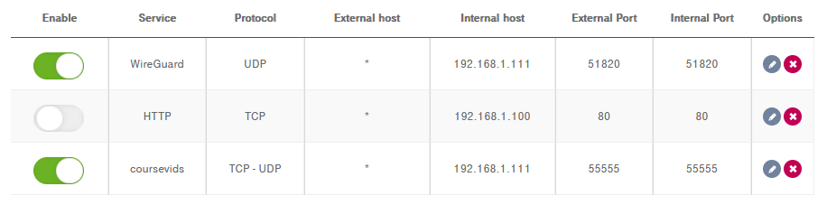
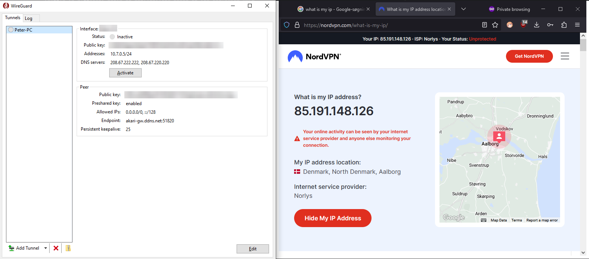
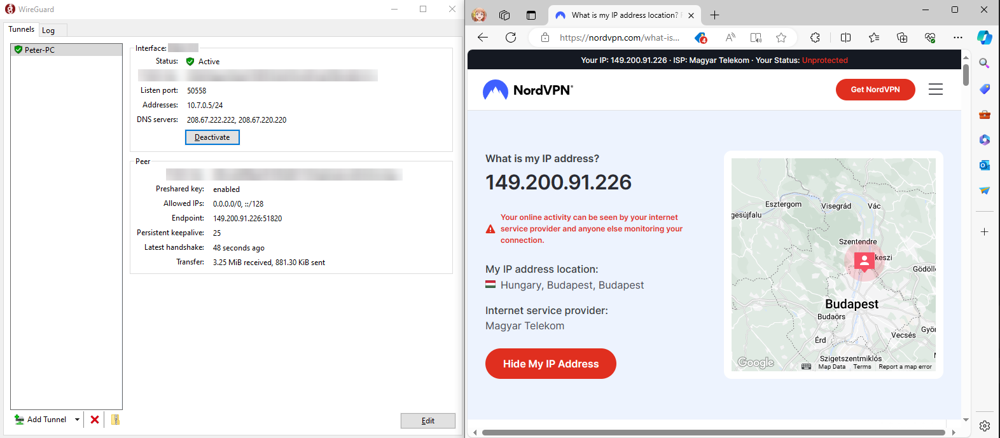

# Networking

## OSI-ISO model

The OSI (Open Systems Interconnection) model, is a conceptual framework used to understand and describe 
the functions of a networking or telecommunication system. 

The OSI model is divided into seven layers, each responsible for a specific aspect of network communication. 
These layers, from the bottom to the top, are:

1. The Physical Layer deals with the transmission and reception of
   raw data bits over a physical medium, such as cables or wireless signals.


2. The Data Link Layer provides error-free and reliable transmission of
   data frames between adjacent network nodes, typically through techniques
   like error detection and flow control.
   This is the part where "dumb" network devices, like (L2) switches operate, based on
   (physical) L2 switches make forwarding decisions based on the destination MAC address
   in the Ethernet frame headers. They maintain a MAC address table to learn
   and associate 48bit MAC addresses with specific switch ports, allowing efficient
   switching of frames within the same network segment.


3. The Network Layer handles logical addressing and routing of data packets
   between different networks, allowing data to be transmitted across
   multiple network nodes to reach the intended destination.
   Routers are typically operating at this level.
   Routers are responsible for routing packets, performing
   routing protocols, and maintaining routing tables to determine
   the best path for packet delivery.
   (ICMP, ping works here)


4. The Transport Layer ensures reliable delivery of data by establishing
   end-to-end connections, segmenting data into smaller units, managing
   flow control, and providing error recovery mechanisms.
   TCP and UDP, transmission control protocol and user datagram protocol
   are two prominent transport layer protocols in the tcp/ip suite.
   They are responsible for delivering data packets (safely) between devices.

   TCP ensures reliable and orderly delivery, error detection, flow control, congestion control
   counteracts damaged and lost packets. 
   We will mostly see this preferred where we need accurate data transmission like in web, email, file download.
   connection oriented through a 3-way handshake, always request-respond-confirm

   UDP in the meanwhile is lightweight, has very light overhead and
   provides no reliability, guarantee or confirmation whether
   a package successfully arrived.
   It is preferred where low latency is required, like gaming, DNS queries, or VoIP and live streaming services.

   
    _The image above shows an example of tcp packets captured by Wireshark._


5. The Session Layer establishes, manages, and terminates communication
   sessions between applications, enabling synchronization and coordination
   of data exchange between them.
   It incorporates session-like features, but mostly this is nowadays done in upper layers,
   mainly in the application layer for simplicity, HTTP, SSH, FTP, etc.


6. The Presentation Layer is responsible for data formatting, compression,
   encryption, and decryption, ensuring that data sent by the application.
   The data in this layer is in a format that can be understood by the receiving application.
   For example compressing jpg images sent is done by the presentation layer.


7. The Application Layer represents the layer closest to the end-user and
   provides services and protocols for network applications to access network
   resources, such as email, file transfer, and web browsing.


## Route of a packet between a client computer and the server hosting the class videos

The operating system receives the request from the browser, it wraps up the packet going through all the layers. Then sends it to the network interface (hardware) handling the 
physical transmission of it. During this part, several different things occur:

### DNS

DNS, or Domain Name System, facilitates the translation of human-readable domain names into IP addresses, 
making it easier to navigate the internet. For instance, when accessing a website like "akari-gw.ddns.net", 
a DNS query is initiated to determine the corresponding IP address. 
This process is akin to a reverse lookup, where domain names are resolved to IP addresses. 
Notably, IP addresses can change, necessitating frequent updates within the DNS system.

DNS operates within a hierarchical structure. At the top are the root DNS servers, labeled A through M.
Beneath these are top-level domain (TLD) servers (like .com), followed by domain-specific servers. 
When a query is initiated, such as by using the "nslookup" command, the local system first checks its own table for the corresponding IP address. 
If not found, it consults the router's table, and if still unresolved, the query is sent to the Internet Service Provider's DNS server.

From there, the DNS server acts on behalf of the client, recursively querying higher-level servers until the requested IP address is found. 
This process ensures efficient and accurate resolution of domain names to IP addresses, enabling seamless communication across the internet.



The DNS service typically operates through port 53 and UDP.



### ARP

In local area networks (LANs), devices communicate with each other using a combination of MAC (Media Access Control) addresses and IP addresses. 
Within a LAN segment, packets are forwarded based on the MAC addresses of the devices. 
This means that computers within the same network exchange data directly using MAC addresses, 
which are unique identifiers assigned to network interfaces.
This process ensures efficient and direct communication between devices within the LAN, without the need for additional layers of routing.

MAC addresses are 48 bits long, globally unique and every network interface has one. The emphasis on interface. A computer having a network card with an ethernet cable slot,
as well as a built-in WiFi antenna has two MAC addresses (at minimum). A router with 5 cabled ports and NO WiFi has 5 MAC addresses and so on.

While devices interact with each other at the MAC address level, users typically interact with devices using IP addresses. 
This abstraction allows for easier management and understanding of network communication at a higher level.

Operating at Layer 2 of the OSI model, the Address Resolution Protocol (ARP) plays a role in communication within LANs. 
ARP resolves IP addresses to MAC addresses, enabling devices to communicate effectively within the local network.

Consider a scenario where a device (Device A) within the LAN wishes to communicate with another device (Device B) on the same network:

* If Device A only knows the IP address of Device B, it must utilize ARP to resolve the IP address to the corresponding MAC address.
* First, device A checks its ARP cache (a local table that maps IP addresses to MAC addresses) to see if it already knows the MAC address
corresponding to Device B's IP address.
* The following command can be used in a Windows terminal to retrieve ARP table information:

```
arp -a
```

* If it's not found, Device A sends out an ARP request broadcast packet
to the entire LAN, asking, _"Who has this IP address?"_. The devices "spam" the local network with broadcast messages
the typical interpretation of a package is: _"Who has 192.168.1.6? Tell 192.168.1.2"_

* Upon receiving the ARP request, the device with the corresponding IP address (Device B) replies directly to Device A
with its MAC address, saying, "I have that IP address, and here is my MAC address."
So broadcast as a request but only a direct reply.

* Device A updates its ARP cache with the MAC address of Device B for future reference, so it doesn't have to send ARP requests
for the same IP address again in the near future. This helps in optimizing network traffic.

* Communication: Now that Device A knows the MAC address of Device B, it can send data packets directly to Device B
using Ethernet frames with Device B's MAC address as the destination.



Then quickly over time, the machines local tables converge to the actual state of the network.

> ARP can also be used to see whether an ip address is reserved or not.

## DHCP

We know that (all) network connected devices has to have IP addresses to communicated with protocols built upon the TCP/IP stack, but
another thing worth mentioning here is how IP addresses are usually assigned at (home) networks.

> On Windows, we can check the various IP addresses of our computer with `ipconfig`. It will print all properties of the various
> physical or virtual network interfaces our computer may have.
> 
> ```
> ipconfig /all
> ```
> 
> On Linux, it is done by the `ip` command:
> 
> ```
> ip a
> ```


Dynamic Host Configuration Protocol (DHCP) is a network management protocol used on local networks to
automatically assign IP addresses and other network configuration parameters to devices.
It simplifies the process of network administration by eliminating the need for manual configuration
of devices with unique IP addresses within a network.



1. **DHCP Discover:** basically the client initialization: When a device, such as a computer or smartphone, connects to a network,
it sends out a broadcast message known as a DHCP Discover message to discover DHCP servers on the network.
This message is typically sent over UDP (User Datagram Protocol) on port 67.

2. **DHCP Server Offer:** when a DHCP server receives a DHCP Discover message, it checks its pool of
available IP addresses and selects one to offer to the client. The DHCP server then sends a DHCP
Offer message to the client, offering an IP address along with other network configuration
parameters such as subnet mask, default gateway, and DNS server addresses.
This message is sent over UDP on port 68.

3. **Client Request:** upon receiving the DHCP Offer message, the client evaluates the offered IP address
and other configuration parameters. If it accepts the offer, it sends a DHCP Request message to
the DHCP server, confirming the acceptance of the offered IP address.

4. **DHCP Acknowledgment:** Once the DHCP server receives the DHCP Request message from the client,
it sends a DHCP Acknowledgment (ACK) message to the client, confirming that the offered
IP address has been successfully assigned to the client. This message also includes the
lease duration for which the IP address is valid.

The client now configures its network interface with the IP address and other
configuration parameters received from the DHCP server. The lease duration specifies how long the
client can use the assigned IP address before it must renew the lease with the DHCP server.

As the lease expiration approaches, the client may attempt to renew its lease by
sending a DHCP Request message to the DHCP server. If the DHCP server is available and the IP address
is still available in its pool, it may renew the lease by sending a DHCP Acknowledgment message
to the client, extending the lease duration.
If the client does not renew its lease and the lease duration expires,
the IP address is released back to the DHCP server's pool of available addresses and can be assigned
to another client.

DHCP servers can typically be given a range from which they can assign IP addresses to devices.



An "extension" of this DHCP process is the "DHCP binding" or "static binding".
In routers, we can assign MAC addresses to specific IP addresses manually. From that point onward, the router
will only assign that IP address to the specified device.



> Of course it is up to the individual devices to honour the offered IP addresses:
> 
> 

### Local and "global" IP addresses, IP address ranges

The difference between LAN and WAN IP addresses lies primarily in their scope and purpose.
LAN IP addresses are used for local communication within a network, while WAN IP addresses
are used for communication between different networks, typically over the internet.
Additionally, LAN IP addresses are private and not routable over the internet, while WAN
IP addresses are public and routable.

#### Why NAT?
LAN IP addresses are determined and managed by local routers, while WAN IP addresses are assigned by an
Internet Service Provider (ISP) and globally unique.

Between them, we need Network Address Translation (NAT), translating them between one another.
NAT allows multiple devices within a private network to share a single public IP address.

So again, why do we need both local and global IPv4 addresses?
Consider the IPv4 address range, which is roughly 4.3 billion. 

However, not all of these addresses are publicly available. There are also: 
* Private ranges such as 10.0.0.0/8, 192.168.0.0/16, 
* link-local addresses like 169.254.0.0/16 (used when no IP configuration is available), 
* loopback addresses like 127.0.0.1/8, 
* and other reserved addresses like 0.0.0.0/8 

all of these account for approximately 300 million addresses, leaving us with around 4 billion.

Considering the Earth's population of roughly 7.9 billion, although not everyone is connected to the internet, 
the number of devices in use is substantial. 
For example, I alone have at least 10 devices, like my phone, work phone, computer, home server, laptop, smart tv, router, printer, 
network connected speaker, ~~(smart fridge, toaster, roomba)~~ etc. and internet providers manage numerous devices across various networks.
Websites run on servers with multiple addresses. 

Consequently, the IPv4 address space falls short. 
Thus, we employ various techniques to translate local and semi-local addresses into global ones.

#### NAT methods

*  **Static NAT:** In Static NAT, a one-to-one mapping is established between a private IP address and a public IP address.
   This ensures that a particular private IP address always corresponds to a specific public IP address.
   Static NAT is commonly used when internal servers need to be accessed from the internet.

* **Dynamic NAT:** Dynamic NAT assigns public IP addresses from a pool of available addresses on a first-come,
  first-served basis as internal devices initiate outbound connections to the internet.
  The mapping between private and public IP addresses is dynamic and changes as connections are established and terminated.
  Done by internet service providers.

* **Port Address Translation (PAT):** Also known as NAT overload, PAT maps multiple private IP addresses to a single public IP
  address using different port numbers. This allows multiple devices within a private network to share a single public IP address.
  Used in home and small office networks where only one public IP address is available.

* **NAT64:** NAT64 facilitates communication between IPv6-only and IPv4-only devices by translating IPv6 addresses to IPv4
  addresses and vice versa. This is necessary during the transition from IPv4 to IPv6,
  allowing IPv6 devices to access IPv4 content and services on the internet.

* **NAT-PT** (Network Address Translation-Protocol Translation): NAT-PT translates between IPv4 and IPv6 protocols,
  allowing devices using different IP versions to communicate with each other. However, NAT-PT has been deprecated
  in favor of other transition mechanisms like NAT64 and Dual-Stack.

* **Bidirectional NAT:** Bidirectional NAT allows translation of both source and destination IP addresses and ports.
  It's typically used in scenarios where internal clients need to access external servers while external clients also
  need to access internal servers.

#### IPv6 in 2 minutes or less..

In contrast, IPv6 addresses alleviate this scarcity issue. With IPv6, addresses are 128 bits long 
(compared to the 32 bits long IPv4 addresses), significantly expanding the available range. 
Each bit effectively doubles the address space, resulting in a staggering **340 undecillion** 
(340000000000000000000000000000000000000) addresses allowing us to connect quite a lot of smart light bulbs! :)

An IPv6 address can look like this: `FE80:0000:0000:0000:0202:B3FF:FE1E:8329`. 
Each character can take the range between `0-9` and `A-F`.

There are also a few key rules to shorten IPv6 addresses:

**Leading Zeros Omission:** Leading zeros within each 16-bit block can be omitted. For example, 
the address "2001:0db8:0000:0000:0000:0000:1428:57ab" can be shortened to "2001:db8:0:0:0:0:1428:57ab".

**Consecutive Block Omission:** One or more consecutive blocks of zeros can be replaced with 
double colons "::" once within an IPv6 address. This can only be done once in an address to avoid ambiguity. 
For example, "2001:0db8:0000:0000:0000:0000:1428:57ab" can be shortened to "2001:db8::1428:57ab".

IPv6 addresses can be expressed using a combination of both of the rules above.
For instance, "2001:0db8:0000:0000:0000:0000:1428:57ab" can be written as "2001:db8::1428:57ab:0:0".

### Routing

If the local network is big, a packet also need to be routed through the network. 
Like imagine a company or university network - a lot more device than just a router and a few devices connected to it like at a regular household.

Routing protocols at local networks: OSPF (Open Shortest Path First), RIP (Routing Information Protocol ).

Leaving the home network, after the packet reaches the outside network, it will pass through multiple networks to reach
its final destination. For that, there are also various routing protocols, like BGP (border gateway protocol),
but they shall not be elaborated here.
They simply ensure, that the packet of ours gets delivered in a timely manner.

Finally, we arrive to the destination networks.

### Ports, port forwarding

TCP and UDP communication rely on ports, such as the 55555 port that the video server is utilising. 

Each PC can have the same ports available, and multiple PCs can use the same ports simultaneously. 
However, by default, routers typically don't permit incoming requests to various PCs. We'll delve into this later.

Ports in networking serve as endpoints for communication protocols like 
TCP (Transmission Control Protocol) and UDP (User Datagram Protocol). 

These ports are categorized into three main types:
* **Well-known ports:** Also known as system ports or privileged ports, these ports are numbered from 0 to 1023. 
They are reserved for specific services or protocols commonly used by system processes or network applications. For example:
  * **Port 80:** Reserved for HTTP (Hypertext Transfer Protocol), commonly used for web traffic.
  * **Port 443:** Reserved for HTTPS (Hypertext Transfer Protocol Secure), used for secure web traffic.
  * **Port 22:** Reserved for SSH (Secure Shell), used for secure remote access.

* Registered ports: Numbered from 1024 to 49151, registered ports are assigned by the 
Internet Assigned Numbers Authority (IANA) to specific applications or services upon request. 
These ports are often used by various applications beyond the scope of system services. For example:
  * **Port 3306:** Commonly used by MySQL database servers for client-server communication.
  * **Port 5432:** The default port for PostgreSQL database servers.

* **Dynamic or private ports:** Ranging from 49152 to 65535, dynamic ports are available for use 
by any application or service. These ports are commonly used for temporary purposes, 
* such as client-side connections or ephemeral ports assigned dynamically by the operating system.

> It's important to note that ports facilitate bidirectional communication, 
with each end of a communication session typically using a different port. 
For example, when a web browser (client) requests a webpage from a web server, 
it typically connects to port 80 (HTTP) or port 443 (HTTPS) on the server's IP address.

> Additionally, some applications or protocols may use port ranges rather than individual ports. 
> For example, FTP (File Transfer Protocol) utilizes ports 20 and 21, with port 20 used for data transfer 
> and port 21 used for control commands.

Within a local network, numerous devices like PCs and servers coexist. 
When a package is sent, it contains information about the home IP address and the intended port. 
However, if multiple devices are running the same port, determining the correct destination becomes challenging.

This is where the router, if configured appropriately, comes into play. 
It can maintain a table that maps specific ports to particular addresses, 
essentially acting as a traffic director. 
For instance, this is where I specify my server and port assignment, as demonstrated on the router settings.

So, when a package reaches the router, it effectively inquires about the port's destination.
(In practice, the router doesn't engage in a conversation it simply routes the package to its destination based on the port mapping.Ö
It encapsulates the information in an IP packet, ensuring that both the 
MAC and IP addresses of the device are known for successful delivery.



_Example of port forwarding in a household router._

### Switching, server

After the router, the package traverses through the network switch within my network,
it undergoes a process where the switch examines the MAC address at the data link layer
and then forwards the package accordingly to the server.

The web server is configured to actively listen for incoming requests on the 55555 port,
while also performing user authentication.
Once authenticated, the server grants read access to the designated portion of the filesystem.

### Reverse proxy, nginx

When hosting multiple web applications on a server, managing them efficiently becomes essential. 
Typically, web servers like Nginx listen on ports 80 for HTTP and 443 for HTTPS by default. 
However, if you're running multiple web applications on the same server, assigning different ports for 
each application can quickly become cumbersome.

This is akin to the challenge we face with IP addresses and domain names. 
Instead of expecting users to remember various ports (e.g., 80, 81, 8080, etc.), which can be inconvenient, 
we can employ domain names (or paths) to simplify access.

To address this issue, we utilize a technique called reverse proxying. 
A reverse proxy sits in front of multiple web applications and routes incoming requests based on predefined rules. 
This allows us to map subdomains or different paths to specific applications.

For instance, we can run each application on arbitrary ports like 8080, 8081, and 8082, provided they're available. 
Then, using a reverse proxy like Nginx, we can map these applications to subdomains or different paths. 
Paths can represent distinct directories, but nowadays, routers and services handle this mapping dynamically.

> Nginx (pronounced "engine-x") is a high-performance, open-source web server and reverse proxy server software. 
 
In practice, when a client sends a request destined for port 80 on the server, 
along with a specific path like "example.com/something", Nginx steps in to handle the request. 
Nginx interprets the requested path and resolves it to a specific port locally, based on predefined rules or configuration settings.

For instance, if the requested path "example.com/something" corresponds to a separate web application running on port 8082, 
Nginx will direct the incoming request to that specific port. This process is managed seamlessly by Nginx acting as a reverse proxy, 
efficiently routing the request to the appropriate backend application based on the requested domain and path.

In essence, Nginx serves as a mediator between the client and the backend applications, intelligently directing 
traffic to different ports or applications based on the requested URLs.

Finally, various backend services running on the server behind the reverse proxy actually answer the original call, and
this whole process goes back the other way around with the answer message, a website, and/or an opened video stream.

## VPNs

A Virtual Private Network (VPN) is a technology that establishes a secure connection over a public network, such as the internet.
It allows users to transmit and receive data as though their devices were directly linked to a private network,
even when accessing the internet via public Wi-Fi hotspots or other networks.

In terms of functionality, VPNs typically require specific ports to establish and maintain connections.
For example, the WireGuard VPN protocol, operates over UDP (User Datagram Protocol) and requires the configuration
of specific port settings for communication between devices.

The fundamental principle behind VPNs involves encryption, which safeguards data from potential threats like hackers,
Internet Service Providers (ISPs), or government surveillance agencies.
This encryption ensures that any data transmitted between the user's device and the VPN server remains secure and confidential.

VPNs can help bypassing geo-restrictions by enabling users to access content or services that may be restricted based on geographic location.
VPNs can provide anonymity by masking the user's IP address and encrypting their internet traffic, VPNs can enhance anonymity and privacy online.
VPNs can help with securing public Wi-Fis by providing an additional layer of security when connecting to public Wi-Fi networks,
protecting against potential threats such as data interception or unauthorized access.





##### mediaklikk
##### my server through a local IP address / with a domain, show how it won't load